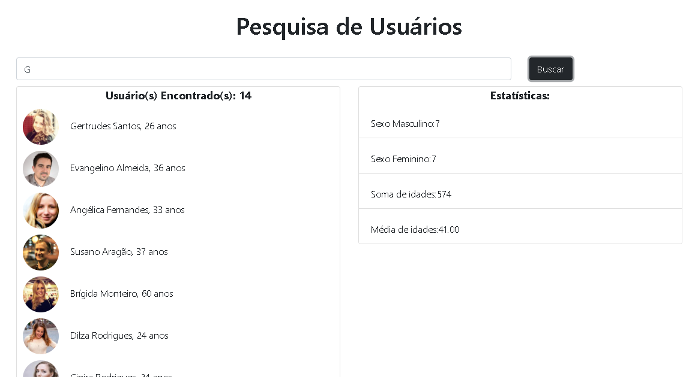

### Pesquisa de Usuários 🧍‍♂️🧍‍♀️

---
---

<p align="center">
   
</p>

---
<div align="center">

[](https://github.com/gabiqrm/PesquisaUsuarios)<space> <space>[](https://github.com/gabiqrm/PesquisaUsuarios/blob/master/LICENSE)<space> <space>[](https://github.com/gabiqrm/PesquisaUsuarios/)

</div>

---
## Sobre: 
Aplicação desenvolvida durante o desafio final do Módulo 01 do Bootcamp Desenvolvimento Fullstack disponibilizado pelo Instituto de Gestão e Tecnologia da Informação - IGTI. 
A aplicação consiste em uma lista de usuários disponível via requisição fetch que permite, ao pesquisar pelo nome dos mesmos, atualizar de forma dinâmica o quadro de estatísticas, que traz algumas informações conforme filtros.
Foram adicionados a estilização e alguns comportamentos.

---
## Objetivo:
Desenvolver as habilidades em JavaScript, HTML e CSS e requisições HTTP.
O capítulo foca em requisições HTTP e utilização de Promises, além de trabalhar as formas de manipulação de arrays do JS Moderno e funções de Event Loop
---
##  Bibliotecas e Tecnologias Utilizadas:    

- **[HTML5]**
- **[JavaScript]**
- **[CSS3]**
- **[Bootstrap]** 
- **[ES6+]**
- **[Visual Studio Code]**

---
##  Execução:

1. Clonar via prompt de comando o projeto em uma pasta de sua preferência: `git clone https://github.com/PesquisaUsuarios`
2. Acessar a pasta principal do projeto via prompt de comando. Ex: `cd PesquisaUsuarios`;
3. Na pasta raiz, executar o arquivo: `index.html`

---
## 🔗 Contribuições:
```
- Faça o fork do projeto (https://github.com/Cobrinha)
- Crie uma branch para sua modificação (git checkout -b feature/[nome])
- Faça o commit (git commit -am 'Add files [nome]')
- Push (git push origin feature/[nome])
- Crie um novo Pull Request
```
---
## 🔐 Licença:
Esse projeto está sob a licença MIT. Veja o arquivo [LICENSE](LICENSE) para mais detalhes.

---

## 👩🏻‍💻 Desenvolvedora:

Desenvolvido por Gabriela Queiroz ! 💜
